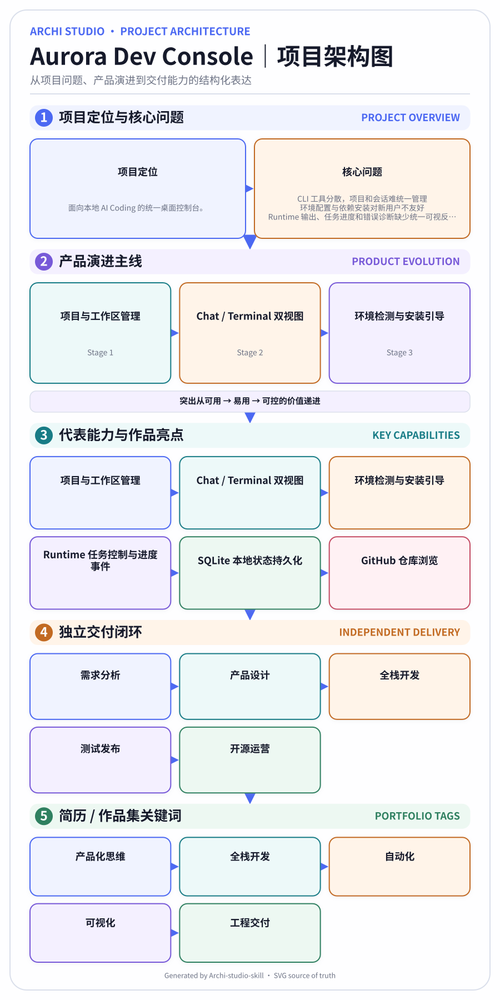
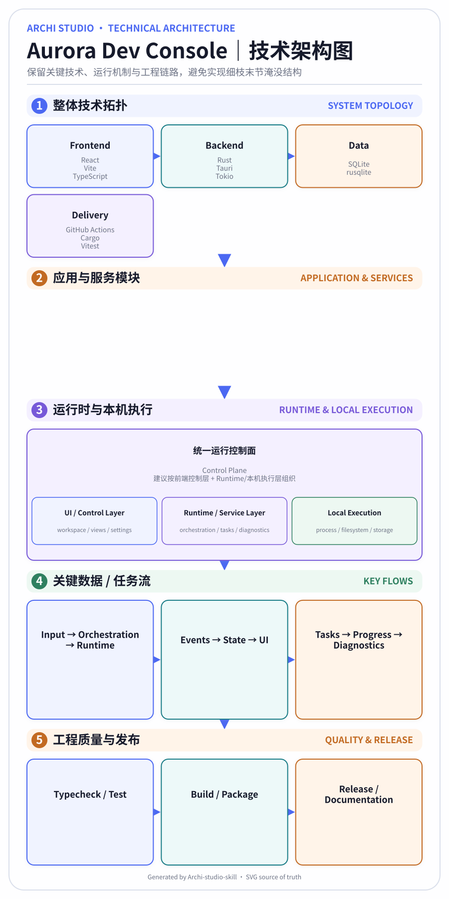

# Archi-studio-skill

> Agent-first architecture diagram studio: **project understanding → interactive intent questionnaire → Project Architecture + Technical Architecture → auto-layout / typography / palette tuning → QA & auto-fix → SVG / PNG / PDF / A4 → interactive refinement**.

Archi Studio is a reusable Skill for turning project materials into polished, editable architecture deliverables. Architecture drawings are generated **programmatically from SVG**; no image-generation model is required.

## Effect preview

| Project Architecture | Technical Architecture |
|---|---|
|  |  |

### Interactive editor

The browser editor supports live palette switching, typography scaling, density/config adjustment, title copy edits, JSON config export, and **SVG / PNG export**. Structural changes remain reproducible: edit `diagram_specs.json` / `diagram.config.json`, then run `render-bundle` to re-layout, QA, and export again.

## Why this Skill exists

Architecture-diagram work usually mixes five different jobs: understanding the project, deciding what to communicate, selecting a visual system, laying everything out without overflow, and iterating after feedback. Archi Studio separates those concerns into machine-readable layers so an Agent can automate the whole process without turning the output into a one-off canvas.

```text
User materials
   ↓
Evidence-aware intake
   ↓
Project Semantic Model
   ↓
Interactive intent questionnaire + visual references
   ↓
Project Architecture Spec + Technical Architecture Spec
   ↓
Auto-layout → SVG renderer → QA / auto-fix loop
   ↓
SVG / PNG / PDF / A4 + source JSON + interactive editor
   ↓
Natural-language or browser refinement → deterministic re-render
```

## Core capabilities

- **Project ingestion** — README/docs/config/source trees and ZIP-extracted projects.
- **Evidence-aware semantic modeling** — positioning, pain points, capabilities, modules, evolution, stack, delivery chain.
- **Noise-resistant analysis** — examples/tests/fixtures are lower-confidence evidence and do not override authoritative root project facts.
- **Interactive questionnaire** — CLI questionnaire plus browser questionnaire with 4 visual style references.
- **Dual-diagram planning** — Project Architecture + Technical Architecture are planned separately but share a visual system.
- **Programmatic SVG rendering** — editable vector source of truth with multilingual typography.
- **Auto-layout and quality checks** — crowding, overflow risk, density, spacing and hierarchy checks with iterative auto-adjustment.
- **Four commercial-ready palettes** — `cool-professional`, `portfolio-premium`, `academic-light`, `warm-business`.
- **Multi-format export** — SVG, high-resolution PNG, PDF and A4 side-by-side PDF.
- **Interactive browser refinement** — palette, type scale, density/config, title edits, SVG/PNG/config downloads.
- **Agent-native structural editing** — natural-language requests map to JSON spec/config edits and deterministic re-rendering.

## Quick start

```bash
git clone https://github.com/JananZZZ/Archi-studio-skill.git
cd Archi-studio-skill
python -m pip install -e '.[dev]'

# Interactive CLI questionnaire
archi-studio build /path/to/project --out ./architecture-output

# Fully automatic default build
archi-studio build /path/to/project --out ./architecture-output --non-interactive

# Use config downloaded from the browser questionnaire/editor
archi-studio build /path/to/project --out ./architecture-output --config ./diagram.config.json

# After an Agent/user edits diagram_specs.json or diagram.config.json
archi-studio render-bundle ./architecture-output

# Serve the generated browser editor
archi-studio serve-editor ./architecture-output/interactive_editor.html
```

## Output bundle

```text
architecture-output/
├── 01_Project_Architecture.svg
├── 01_Project_Architecture.png
├── 01_Project_Architecture.pdf
├── 02_Technical_Architecture.svg
├── 02_Technical_Architecture.png
├── 02_Technical_Architecture.pdf
├── 03_A4_SideBySide.pdf
├── questionnaire.html
├── interactive_editor.html
├── project_model.json
├── diagram_specs.json
├── diagram.config.json
├── qa_report.json
└── source_manifest.json
```

`SVG` is the rendering source of truth. PNG/PDF uses CairoSVG when available and falls back to Inkscape CLI. A4 composition uses PyMuPDF.

## Interactive workflow

### 1. User provides project materials

The Agent reads the project evidence before drawing. Root README/config/manifests are authoritative by default; examples, tests, fixtures and sample projects are treated as secondary evidence.

### 2. Intent questionnaire + visual references

The Skill asks only high-value choices:

- use case: Resume / Portfolio / Academic / Business
- content density: Concise / Balanced / Detailed
- language: Chinese + necessary English/technical abbreviations, bilingual, Chinese or English
- emphasis: product evolution / technical architecture / balanced
- visual palette: one of four built-in presets

`questionnaire.html` can export a ready-to-use `diagram.config.json`.

### 3. Automatic deep optimization

The engine separates:

- `project_model.json` — factual project understanding and evidence
- `diagram_specs.json` — what the two diagrams communicate
- `diagram.config.json` — typography, palette, density and layout preferences

Then it runs layout → QA → auto-adjust loops before rendering final outputs.

### 4. Interactive refinement

Light visual edits happen in the browser editor. Structural requests such as:

> “Merge these two modules, but keep two internal layers.”

are handled by the Agent editing JSON specs and invoking:

```bash
archi-studio render-bundle ./architecture-output
```

This keeps every change reproducible and source-controlled.

## Agent integration

- `SYSTEM_PROMPT.md` — final system prompt for the architecture Agent.
- `SKILL.md` — operational contract / execution rules.
- `AGENT_INTEGRATION.md` — tool orchestration and integration guidance.
- `prompts/` — intake, analysis, questionnaire, planning, optimization and tuning prompts.
- `schemas/` — machine-readable schemas for preferences, semantic model and diagram specs.

Recommended Agent loop:

```text
inspect evidence → resolve ambiguity → collect minimal preferences
→ build semantic model → plan dual specs → render → QA/autofix
→ present previews → accept natural-language refinements
→ re-render → final package
```

## Quality / Release Gate

The repository includes automated unit, integration, CLI, raster export and real Chromium interaction tests. The release gate covers:

- authoritative-source vs example/test contamination
- technical-stack token-boundary detection
- all four visual presets
- dual-diagram build
- zero-critical QA requirement
- deterministic bundle re-render
- package ZIP generation
- CLI config roundtrip
- SVG / PNG / PDF / A4 export
- interactive editor palette/title/SVG/PNG download flows
- browser questionnaire config export flow

Run locally:

```bash
pytest -q
python -m archi_studio.cli build examples/sample_input --out /tmp/archi-demo --non-interactive
```

GitHub Actions runs the same release gate on push and pull request.

## Repository structure

```text
Archi-studio-skill/
├── archi_studio/           # core engine
├── prompts/                # Agent prompt stages
├── schemas/                # JSON schemas
├── presets/                # color/style references
├── templates/              # extension templates
├── tools/                  # preset/build utilities
├── scripts/                # bootstrap / validate / package
├── tests/                  # unit, integration and Chromium interaction tests
├── examples/               # sample input + generated output
├── docs/                   # workflow, quality and screenshots
├── SYSTEM_PROMPT.md
├── SKILL.md
├── AGENT_INTEGRATION.md
└── skill.yaml
```

## Design presets

| Preset | Best for |
|---|---|
| `cool-professional` | Resume / engineering overview |
| `portfolio-premium` | Portfolio / product storytelling |
| `academic-light` | Thesis / defense / academic presentation |
| `warm-business` | Business presentation / executive review |

## Commercial-use design principles

1. **Evidence before aesthetics** — no architecture claim should be invented to fill a box.
2. **SVG as source of truth** — outputs stay editable, diffable and re-renderable.
3. **Chinese-first multilingual typography** — necessary English/technical abbreviations remain intact.
4. **No silent overflow** — QA must fail or auto-adjust rather than accept clipped content.
5. **Separate facts, communication and style** — project model, diagram spec and config are independently editable.
6. **Interactive ≠ destructive** — browser tweaks are lightweight; structural modifications go through the reproducible spec pipeline.

## License

MIT
